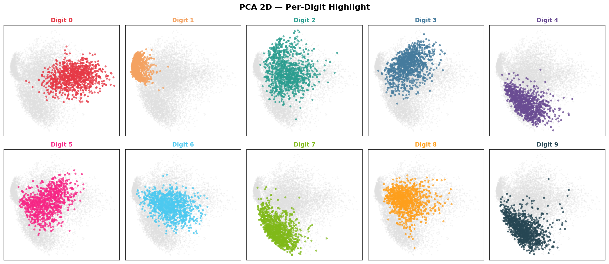
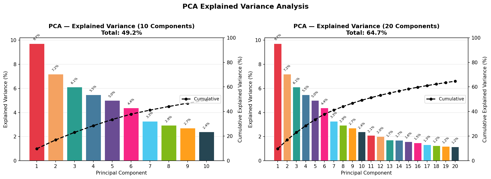
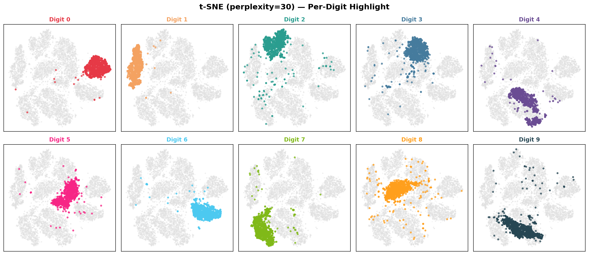
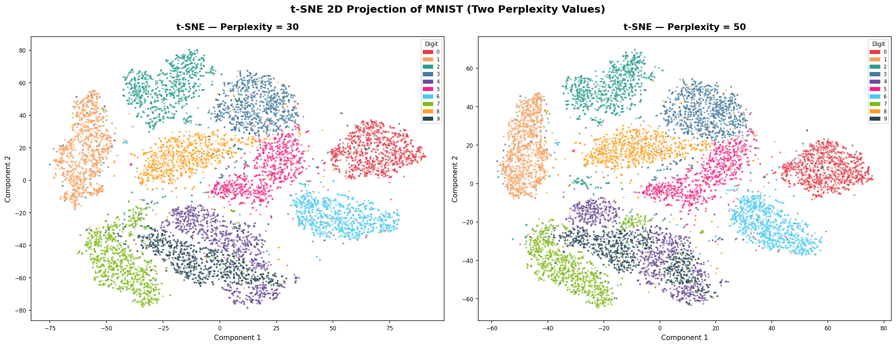
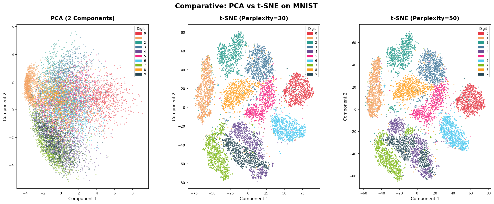
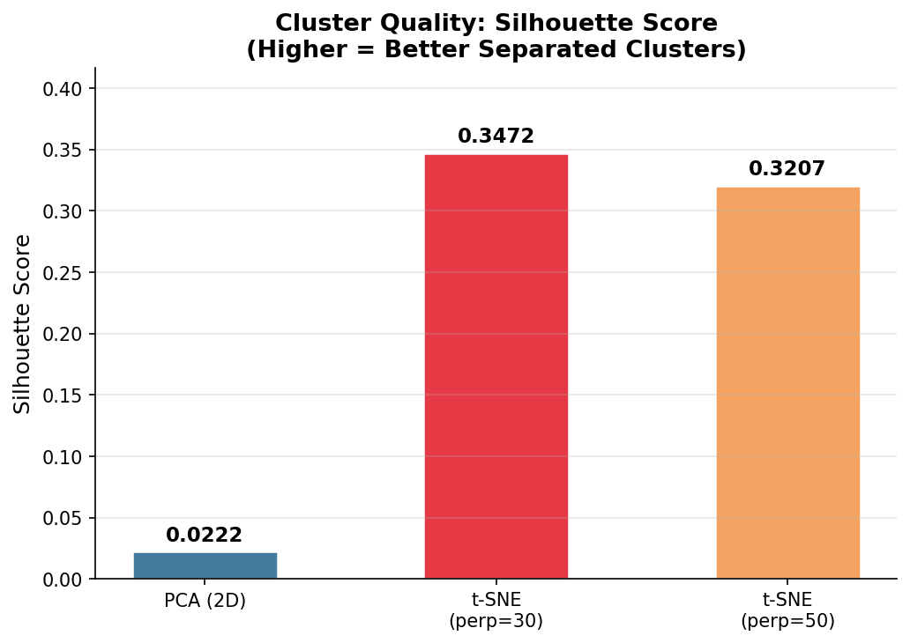

# 🔍 High-Dimensional Data Visualization & Manifold Learning Analysis

<div align="center">

### Understanding Hidden Structure in High-Dimensional Image Data

A comparative machine learning study investigating how linear and nonlinear dimensionality reduction techniques uncover latent patterns within the MNIST handwritten digit dataset.


</div>

---

## 📌 Project Overview

High-dimensional datasets often contain meaningful structures that are difficult to observe directly. Although MNIST images exist in a 784-dimensional feature space, the true relationships between samples often lie on lower-dimensional manifolds.

This project investigates how two widely used dimensionality reduction techniques — **Principal Component Analysis (PCA)** and **t-Distributed Stochastic Neighbor Embedding (t-SNE)** — transform high-dimensional image data into interpretable low-dimensional representations.

The study combines:

- Dimensionality Reduction
- Manifold Learning
- Cluster Analysis
- Quantitative Evaluation
- Visualization Engineering

to understand how different embedding strategies preserve information, reveal class structure, and support exploratory machine learning workflows.

---

# 🎯 Research Questions

This project was designed to answer the following questions:

- How much information does PCA retain when compressing handwritten digit images?
- Can PCA effectively separate visually similar digit classes?
- How does t-SNE reveal hidden manifold structures?
- How does perplexity influence t-SNE embeddings?
- Which technique produces better cluster separation?
- What trade-offs exist between visualization quality and information preservation?

---

# 📊 Dataset & Preprocessing

### Dataset

**MNIST Handwritten Digits**

- 70,000 grayscale handwritten digit images
- 784 features per image (28 × 28 pixels)
- 10 digit classes (0–9)

### Preprocessing Pipeline

```text
Raw Images
     ↓
Flatten Images
     ↓
Normalize Pixels
     ↓
Stratified Sampling
     ↓
10,000 Representative Samples
     ↓
Dimensionality Reduction
```

### Data Preparation Observations

- Loaded 70,000 handwritten digit samples.
- Applied normalization to scale pixel values between 0 and 1.
- Selected a stratified subset of 10,000 samples to improve computational efficiency.
- Maintained class balance across all digit categories.

---

# 🧠 PCA Analysis

Principal Component Analysis was used to project handwritten digit images into a lower-dimensional feature space while preserving maximum variance.

### Key Findings

- First two principal components explain only ~20–25% of total variance.
- Digits **0** and **1** show the strongest separation.
- Digits **3**, **5**, and **8** heavily overlap.
- PCA preserves global structure but struggles with nonlinear class boundaries.

---

## PCA Projection

The visualization below demonstrates how PCA compresses 784-dimensional image data into a two-dimensional representation.



### Observation

Although PCA captures major variance directions, several digit classes remain heavily intertwined, indicating that variance preservation alone is insufficient for class separation.

---

## Explained Variance Analysis

Understanding how much information is retained as additional principal components are introduced.



### Observation

- 10 components retain approximately 60% of total variance.
- 20 components retain approximately 75%.
- Significant information remains distributed across many dimensions.
- Compression quality improves substantially beyond 20 components.

---

# 🌐 Nonlinear Manifold Learning with t-SNE

Unlike PCA, t-SNE focuses on preserving local neighborhood relationships.

This enables the discovery of hidden manifold structures that are often invisible to linear methods.

---

## t-SNE Embedding



### Observation

- Highly compact clusters emerge naturally.
- Digit classes become significantly more separable.
- Local neighborhood structure is preserved effectively.
- Class boundaries become visually interpretable.

---

## Effect of Perplexity

The figure below compares t-SNE embeddings under different perplexity values.



### Observation

**Perplexity = 30**

- Tighter local clusters
- Better local separation
- Slight fragmentation

**Perplexity = 50**

- Improved global cohesion
- More stable cluster organization
- Slightly less compact groupings

---

# ⚖️ PCA vs t-SNE: Comparative Analysis

The following comparison highlights the fundamental difference between linear and nonlinear dimensionality reduction.



### Major Insights

| Characteristic | PCA | t-SNE |
|---------------|------|--------|
| Preserves | Global Variance | Local Neighborhoods |
| Cluster Separation | Moderate | Excellent |
| Interpretability | High | Medium |
| Visualization Quality | Moderate | Excellent |
| Compression Capability | Strong | Weak |
| Reconstruction Support | Yes | No |

### Findings

- PCA prioritizes information retention.
- t-SNE prioritizes structure discovery.
- PCA clusters overlap significantly.
- t-SNE reveals distinct class islands.
- t-SNE uncovers latent manifold geometry hidden within the dataset.

---

# 📈 Quantitative Evaluation

Visual analysis was supported using silhouette score evaluation.

Silhouette score measures how well-separated clusters are relative to neighboring groups.



### Result

- t-SNE achieved substantially higher silhouette scores.
- Quantitative metrics aligned with visual observations.
- Improved cluster compactness confirms superior class separability.

---

# 💡 Key Research Insights

### PCA

✅ Fast and deterministic

✅ Suitable for dimensionality compression

✅ Supports reconstruction

✅ Preserves global variance

❌ Limited class separation

❌ Struggles with nonlinear manifolds

---

### t-SNE

✅ Exceptional visualization quality

✅ Reveals hidden manifold structure

✅ Produces highly separable clusters

✅ Ideal for exploratory data analysis

❌ Computationally expensive

❌ Non-deterministic behavior

❌ Does not preserve global distances

---

# 🛠 Technical Implementation

## Machine Learning

- Principal Component Analysis (PCA)
- t-Distributed Stochastic Neighbor Embedding (t-SNE)

## Data Analysis

- Exploratory Data Analysis (EDA)
- Cluster Analysis
- Variance Analysis
- Manifold Exploration

## Evaluation Metrics

- Explained Variance Ratio
- Silhouette Score

## Visualization Engineering

- Comparative Embedding Visualizations
- Per-Class Analysis
- Statistical Reporting
- Publication-Style Figures

---

# 💻 Technology Stack

| Category | Technologies |
|-----------|-------------|
| Programming Language | Python |
| Machine Learning | Scikit-Learn |
| Data Processing | NumPy, Pandas |
| Visualization | Matplotlib |
| Evaluation | Silhouette Score |
| Dataset | MNIST |

---

# 🚀 Installation

```bash
git clone https://github.com/Astro-Phile/high-dimensional-data-visualization.git

cd high-dimensional-data-visualization

pip install -r requirements.txt

jupyter notebook
```

---

# 📚 Skills Demonstrated

### Machine Learning

- Dimensionality Reduction
- Manifold Learning
- Feature Space Analysis
- Cluster Evaluation

### Data Science

- Exploratory Data Analysis
- Statistical Interpretation
- Experimental Design
- Quantitative Validation

### Visualization

- Scientific Visualization
- Comparative Analytics
- Machine Learning Interpretability

### Software Engineering

- Reproducible Research Pipelines
- Data Processing Workflows
- Modular Analysis Design

---

# 👨‍💻 Author

**Adi Kashyap**

Machine Learning • Data Analytics • Visualization Engineering
